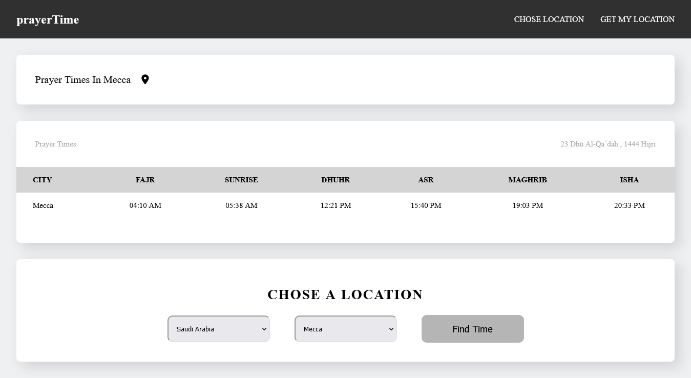

# Prayer Time
### Screenshot

### Links

- Solution URL: [https://your-solution-url.com](https://your-solution-url.com)
- Live Site URL: [https://adib-pop.github.io/Prayer-Time/](https://adib-pop.github.io/Prayer-Time/)

### Built with

- HTML5
- CSS
- JavaScript
- Api (http://api.aladhan.com/v1/timingsByCity?city=Dubai&country=United Arab Emirates&  method=8)

### Useful resources

- (https://aladhan.com/prayer-times-api) - This helped me to get the time of prayer.

## Author

- my GIthub - [adib-pop](https://github.com/adib-pop)

